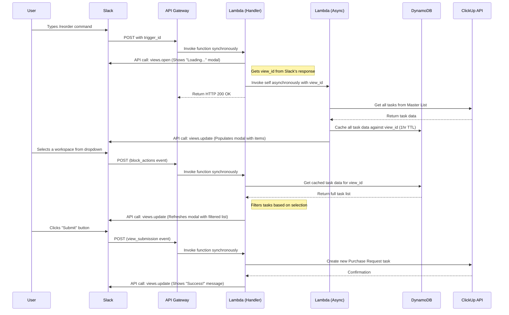

# Facilities Slack Purchase Reorder

## Table of Contents
- [Purpose](#purpose)
- [How It Works](#how-it-works)
- [AWS Infrastructure](#aws-infrastructure)
- [Configuration](#configuration)
- [Testing](#testing)
- [Deployment](#deployment)
- [Usage](#usage)

## Purpose

This script provides a Slack slash command (`/reorder`) that allows users to create purchase requests in ClickUp by selecting from a pre-existing "Master Items" list. Its primary purpose is to streamline the purchasing process by allowing team members to quickly create reorder requests from within Slack, which then automatically become tasks in ClickUp.

## How It Works

The bot functions as a serverless AWS Lambda function triggered by a Slack slash command. It uses an interactive modal for a rich user experience and a background data-loading pattern to provide a fast initial response.

### Components:

*   **Slack Slash Command & Modals:** A custom command (`/reorder`) opens an interactive modal. The function handles the initial command, subsequent user interactions (e.g., filtering), and the final submission.
*   **AWS API Gateway:** Provides a single public URL that Slack sends all requests to (slash command, `block_actions`, `view_submission`).
*   **AWS Lambda:** A serverless function that contains the Python logic. It has two execution paths:
    1.  **Synchronous Handler:** Responds immediately to Slack interactions.
    2.  **Asynchronous Worker:** Handles slow data-loading operations in the background.
*   **AWS DynamoDB:** A table is used to temporarily cache the list of items from ClickUp, making the modal's filtering and sorting operations nearly instant.
*   **AWS Secrets Manager:** Securely stores the ClickUp and Slack API tokens.
*   **AWS SSM Parameter Store:** Stores configuration like ClickUp List IDs and Custom Field IDs.
*   **ClickUp API:** Used to fetch the master list of reorderable items and to create the new purchase request task.

### Visual Flow



### Step-by-Step Data Flow:

1.  **Invoke Slash Command:** A user types `/reorder` in Slack.
2.  **Initial Response:** Slack sends a POST to API Gateway. The Lambda function is triggered synchronously.
3.  **Open Loading Modal:** The function immediately responds to Slack, telling it to open a modal with a "Loading..." message.
4.  **Trigger Async Worker:** The function then invokes itself asynchronously with a special payload (`action: "load_data"`). This ends the initial request, ensuring a fast response to Slack.
5.  **Fetch & Cache Data:** The async worker process fetches the entire "Master Items" list from ClickUp. It then prepares this data and stores it in a DynamoDB table, using the Slack `view_id` as the key. The cache entry has a 1-hour TTL.
6.  **Update Modal:** The async worker calls the Slack API (`views.update`) to replace the "Loading..." content with the interactive modal, now populated with dropdowns for workspaces and items.
7.  **User Interaction:** When the user selects a workspace to filter the list, Slack sends a `block_actions` event to the same API Gateway endpoint.
8.  **Handle Interaction:** The Lambda is triggered synchronously again. It retrieves the full item list from the DynamoDB cache, filters it based on the user's selection, and calls `views.update` to refresh the modal with the filtered item list.
9.  **Submission:** The user clicks "Submit". Slack sends a `view_submission` event.
10. **Create ClickUp Task:** The Lambda function is triggered, retrieves the selected item's details, and creates a new task in the "Purchase Requests" list in ClickUp, mapping relevant fields and adding the requestor's name.
11. **Confirmation:** The function updates the modal one last time to show a "Success!" message.

## AWS Infrastructure

The core infrastructure consists of an IAM Role, secrets in Secrets Manager, SSM Parameters, a DynamoDB table, an API Gateway endpoint, and the Lambda function itself. All related resources are tagged for cost allocation and organization.

### Tags

| Name      | Value                 |
|-----------|-----------------------|
| Project   | slack-slash-reorder   |
| Workspace | facilities            |

## Configuration

Configuration is managed via environment variables set in the `template.yaml`. These variables reference secrets in Secrets Manager and parameters in SSM Parameter Store.

| Environment Variable                          | Description                                                                 | Source              |
| --------------------------------------------- | --------------------------------------------------------------------------- | ------------------- |
| `CLICKUP_SECRET_NAME`                         | The name of the secret in Secrets Manager holding the ClickUp API token.      | Secrets Manager     |
| `SLACK_MAINTENANCE_BOT_SECRET_NAME`           | The name of the secret for the Slack Bot token.                             | Secrets Manager     |
| `CLICKUP_MASTER_ITEMS_LIST_CONFIG_PARAM_NAME` | The name of the SSM Parameter for the Master Items list configuration.      | SSM Parameter Store |
| `CLICKUP_PURCHASE_REQUESTS_CONFIG_PARAM_NAME` | The name of the SSM Parameter for the Purchase Requests list configuration. | SSM Parameter Store |
| `CLICKUP_WORKSPACE_FIELD_ID_PARAM_NAME`       | The name of the SSM Parameter for the Workspace custom field ID.            | SSM Parameter Store |
| `STATE_TABLE_NAME`                            | The name of the DynamoDB table used for state caching.                      | `template.yaml`     |

## Testing

This function includes a suite of unit tests to ensure its logic is correct. The tests mock external dependencies (like AWS, ClickUp, and Slack APIs) so they can be run locally without needing credentials or making real API calls.

### Running Tests Locally

1.  **Navigate to the function's test directory:**
    ```bash
    cd functions/purchase_request/slack_slash_reorder/tests
    ```

2.  **Create a virtual environment (recommended):**
    ```bash
    python3 -m venv .venv
    source .venv/bin/activate
    ```

3.  **Install test dependencies:**
    ```bash
    pip install -r requirements.txt
    ```

4.  **Run the tests using pytest:**
    ```bash
    pytest
    ```

    You should see output indicating that the tests have passed.

## Deployment

The deployment process is managed and specified in the [Deployment Instructions](/docs/Deploying.md).

## Usage

The URL for this function's API Gateway endpoint is used in two places in the "Maintenance Bot" App configuration in Slack:
1.  **Slash Commands:** For the `/reorder` command.
2.  **Interactivity & Shortcuts:** To handle all modal interactions.